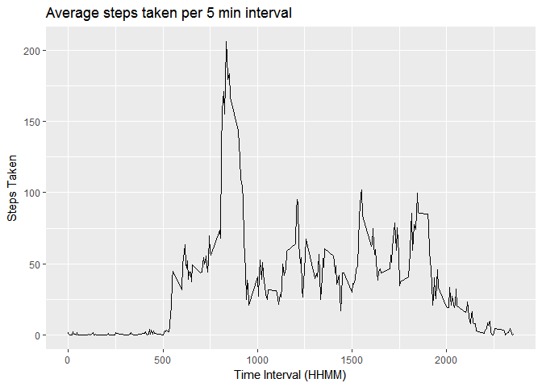

# Reproducible Research: Peer Assessment 1

Assignment completed by: mchantosa

### Introduction

This is a submission for Reproducible Research- Peer Assessment 1. The requirements for this submission are to assess the provided dataset ([available here](https://d396qusza40orc.cloudfront.net/repdata%2Fdata%2Factivity.zip)) as follows:

1. Provide code for reading in the dataset and/or processing the data
1. Produce a histogram of the total number of steps taken each day
1. Provide mean and median number of steps taken each day
1. Produce a time series plot of the average number of steps taken
1. Provide the 5-minute interval that, on average, contains the maximum number of steps
1. Provide code to describe and show a strategy for inputing missing data
1. Produce a histogram of the total number of steps taken each day after missing values are replaced
1. Produce a panel plot comparing the average number of steps taken per 5-minute interval across weekdays and weekends
1. All of the R code needed to reproduce the results (numbers, plots, etc.) should be in this report

### Data

*  **Data profile:** This data is comprised of personal movement data as would be collected by a device like a Fitbit, Nike Fuelband, or Jawbone Up. Device collects movement data at 5 min intervals throughout the day. This data represents two months of data spanning October and November of 2012.
*  **File format:** zipped csv
*  **Data Format:**
    *  **steps:** Number of steps taking in a 5-minute interval (missing values are coded as NA)
    *  **date:** The date on which the measurement was taken in YYYY-MM-DD format
    *  **interval:** Identifier for the 5-minute interval in which measurement was taken, format is integer (HHMM)

### Loading and preprocessing the data

Acquire and load dataset, what does the data look like? What are the variable classes? What are the dimensions of the data? How complete is the data?


```r
#Unzip and load data
rm(list = ls()) #Empty working directory
unzip("activity.zip")
activity <- read.csv("activity.csv")
```


```r
#What does activity look like?
head(activity)
```

```
##   steps       date interval
## 1    NA 2012-10-01        0
## 2    NA 2012-10-01        5
## 3    NA 2012-10-01       10
## 4    NA 2012-10-01       15
## 5    NA 2012-10-01       20
## 6    NA 2012-10-01       25
```


```r
#What are the variable classes?
str(activity)
```

```
## 'data.frame':	17568 obs. of  3 variables:
##  $ steps   : int  NA NA NA NA NA NA NA NA NA NA ...
##  $ date    : Factor w/ 61 levels "2012-10-01","2012-10-02",..: 1 1 1 1 1 1 1 1 1 1 ...
##  $ interval: int  0 5 10 15 20 25 30 35 40 45 ...
```


```r
#What are the dimensions?
dim(activity)
```

```
## [1] 17568     3
```


```r
#How complete is the data?
sum(is.na(activity$steps))#count NAs in steps
```

```
## [1] 2304
```

```r
sum(is.na(activity$date))#count NAs in date
```

```
## [1] 0
```

```r
sum(is.na(activity$interval))#count NAs in interval
```

```
## [1] 0
```

### What are the mean and median total number of steps taken per day?

Calculate total of steps per day and produce histogram of total steps per day. For this process I use the aggregate function. This call of the aggregate function has a default parameter na.action = na.omit, which will automatically remove any NAs from the set of values to be summed, hence no further NA processing is necessary. 


```r
#Plot total steps per day
library(ggplot2)
```

```
## Warning: package 'ggplot2' was built under R version 3.4.1
```

```r
sumStep <- aggregate(steps ~ date, data = activity, sum) #Total steps by date, default utilizes na.omit
qplot(steps, data = sumStep, binwidth = 1000, 
      xlab = "Total steps per day", 
      ylab = "Frequency",
      main = "Histogram of total steps per day for activity dataset") 
```

<!-- -->

What are the mean and median total steps per day?


```r
#Mean total steps per day
mean(sumStep$steps)
```

```
## [1] 10766.19
```

```r
median(sumStep$steps)
```

```
## [1] 10765
```

### What is the average daily activity pattern?

Calculate average number of steps per time interval and produce time series plot for average number of steps per day. NA handling through aggregate same as above. 


```r
#Find and plot the average steps per time interval (as_i)
as_i <- aggregate(steps ~ interval, data = activity, mean) #average steps by interval, default utilizes na.omit
qplot(interval, steps, data = as_i, geom = "line",
      xlab = "Time Interval (HHMM)", 
      ylab = "Steps Taken",
      main = "Average steps taken per 5 min interval")
```

<!-- -->

Which 5-minute interval, on average, contains the maximum number of steps?


```r
as_i[as_i$steps == max(as_i$steps),]$interval
```

```
## [1] 835
```

### Replace missing values

Find average steps per time interval per day, this will serve as a lookup table to fill in data for missing step values from corresponding [day, interval] observations.


```r
#Average steps per time interval per day (as_id)
activity$dayOfWeek <- as.factor(weekdays(as.Date(activity$date)))
as_id <- aggregate(steps ~ interval + dayOfWeek, data = activity, mean)
head(as_id)
```

```
##   interval dayOfWeek steps
## 1        0    Friday     0
## 2        5    Friday     0
## 3       10    Friday     0
## 4       15    Friday     0
## 5       20    Friday     0
## 6       25    Friday     0
```

Confirm that a zero average should have been 0. For this to be true, a corresponding activity[dayOfWeek, interval] subset should have only NA and 0 step values. 


```r
#Spot check, should average steps for Friday at interval 0 be 0
activity[activity$interval == 0 & activity$dayOfWeek == "Friday",]
```

```
##       steps       date interval dayOfWeek
## 1153      0 2012-10-05        0    Friday
## 3169      0 2012-10-12        0    Friday
## 5185      0 2012-10-19        0    Friday
## 7201      0 2012-10-26        0    Friday
## 9217      0 2012-11-02        0    Friday
## 11233    NA 2012-11-09        0    Friday
## 13249     0 2012-11-16        0    Friday
## 15265     0 2012-11-23        0    Friday
## 17281    NA 2012-11-30        0    Friday
```

Find a non-zero average and confirm lookup value. To do this, evaluate a mean from corresponding activity[dayOfWeek, interval] subset and confirm that the lookup mean matches a calculated mean.


```r
as_id[as_id$dayOfWeek=="Thursday", ][220:225,]
```

```
##      interval dayOfWeek   steps
## 1372     1815  Thursday 110.125
## 1373     1820  Thursday  28.250
## 1374     1825  Thursday  36.125
## 1375     1830  Thursday  23.625
## 1376     1835  Thursday   9.250
## 1377     1840  Thursday  42.625
```

Choose to test [interval = 1815, dayOfWeek = Thursday]


```r
#Spot check, confirm recorded mean for interval = 1815 and dayOfWeek = Thursday matches calculated mean.
Th1815Data <- activity[activity$interval == 1815 & activity$dayOfWeek == "Thursday",]
recordedMean <- as_id[as_id$dayOfWeek == "Thursday" & as_id$interval == 1815,]$steps
identical(mean(na.omit(Th1815Data$steps)), recordedMean)
```

```
## [1] TRUE
```

Confirm there are no NA values in the lookup table. NA values could have been introduced if an activity[dayOfWeek, interval] subset was entirely comprised of NA values. If there are NA values, I will need an alternative approach to fill in those NA values in the lookup table.


```r
#Are there any NA values in this dataset?
sum(is.na(as_id$steps))
```

```
## [1] 0
```

Reference lookup table to fill in NA values of activity, I do this in a copy of activity (ac2) to preserve activity for testing.


```r
#Create ac2 from activity
ac2 <- activity

#For each NA value in ac2, look up the average for corresponding interval and dayOfWeek and replace
for(i in which(is.na(ac2$steps))){
        ac2$steps[i] <- as_id[as_id$interval == ac2$interval[i] & 
                                      as_id$dayOfWeek == ac2$dayOfWeek[i],]$steps
}
head(ac2)
```

```
##      steps       date interval dayOfWeek
## 1 1.428571 2012-10-01        0    Monday
## 2 0.000000 2012-10-01        5    Monday
## 3 0.000000 2012-10-01       10    Monday
## 4 0.000000 2012-10-01       15    Monday
## 5 0.000000 2012-10-01       20    Monday
## 6 5.000000 2012-10-01       25    Monday
```

Confirm that all NAs have been replaced


```r
#Check for NAs in dataset
sum(is.na(ac2$steps))
```

```
## [1] 0
```

Confirm that the correct look up value has been asserted, we will continue to use the [interval = 1815, dayOfWeek = Thursday] dataset we tested with above.


```r
#Consider original data for Thursday interval 1815
activity[activity$dayOfWeek=="Thursday"& activity$interval==1815,]
```

```
##       steps       date interval dayOfWeek
## 1084    547 2012-10-04     1815  Thursday
## 3100     31 2012-10-11     1815  Thursday
## 5116    168 2012-10-18     1815  Thursday
## 7132      0 2012-10-25     1815  Thursday
## 9148     NA 2012-11-01     1815  Thursday
## 11164     0 2012-11-08     1815  Thursday
## 13180     0 2012-11-15     1815  Thursday
## 15196    15 2012-11-22     1815  Thursday
## 17212   120 2012-11-29     1815  Thursday
```

Confirm the NA value from activity is filled in with the corresponding lookup mean from as_id in ac2. There is no need to compute the mean, this was already tested.


```r
as_id[as_id$dayOfWeek == "Thursday" & as_id$interval == 1815,]$steps #Lookup table value
```

```
## [1] 110.125
```

```r
activity$steps[9148] #Original value
```

```
## [1] NA
```

```r
ac2$steps[9148] #Fill value
```

```
## [1] 110.125
```

Calculate total of steps per day for the new dataset with NAs filled, and produce histogram of total steps per day. 


```r
sumStep2 <- aggregate(steps ~ date, data = ac2, sum) #Total steps by date, default utilizes na.omit
qplot(steps, data = sumStep2, binwidth = 1000, 
      xlab = "Total steps per day", 
      ylab = "Frequency",
      main = "Histogram of total steps per day for activity dataset with NAs replaced") 
```

<!-- -->
      
### Are there differences in activity patterns between weekdays and weekends?

Add a day_type factor to ac2 which distinguishes between weekday and weekend, then create resulting mean value of steps by interval by dayType dataset.


```r
#Create a factor variable for weekend, define average steps by interval by dayType
ac2$dayType <- "weekday"
ac2[ac2$dayOfWeek %in% c("Saturday", "Sunday"),]$dayType <- "weekend"
ac2$dayType <- as.factor(ac2$dayType)
ap_ww <- aggregate(steps~interval + dayType, ac2, mean)
head(ap_ww)
```

```
##   interval dayType      steps
## 1        0 weekday 2.31071429
## 2        5 weekday 0.45000000
## 3       10 weekday 0.17500000
## 4       15 weekday 0.20000000
## 5       20 weekday 0.08888889
## 6       25 weekday 1.56388889
```

Panel plot comparing the average number of steps taken per 5-minute interval across weekdays and weekends.


```r
#Plot average steps over weekdays by interval, average steps over weekend by interval 
qplot(interval, steps, data = ap_ww, geom = "line", facets = .~dayType, 
      color = dayType, 
      xlab = "Time Interval (HHMM)", 
      ylab = "Steps Taken",
      main = "Average steps taken per 5 min interval, weekend verses weekday")
```

<!-- -->
